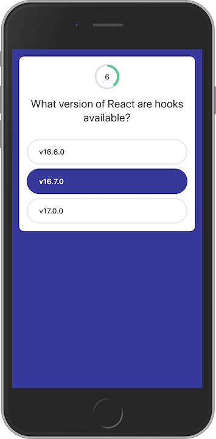

# Triangle ReactJS Meetup - React Hooks

The purpose of this project is to demonstrate the difference between using Hooks (current in v16.7.0-alpha) and class components. This is not meant to be a production-ready project and should be treated as such. Hooks are still very much in alpha. Use at your own risk.

## Slides

Slides for the presentaion are available here: [Google Slides](https://docs.google.com/presentation/d/1rVKG3LATN6JWYbE9JcSBQk_KoOLb26H-Dn9wt1R8BR8/edit?usp=sharing)

## Cheat Sheet
[View Cheat Sheat](hooks-cheat-sheet.md)

## Triva App

<div style="text-align:center">
  
</div>

### Scripts

#### Start - starts webpack-dev-server
```bash
yarn start
```

### LOC Differences
| File     | LOC w/o Hooks | LOC w/ Hooks | Difference |
|----------|---------------|--------------|------------|
| App.tsx  |            42 |           29 |         13 |
| Quiz.tsx |            90 |           69 |         21 |

### Some Takeaways
* Using hooks for the most part felt much easier and faster than implementing a class component.
* Using hooks for the interval (countdown) was actually more of a pain with hooks than a class.